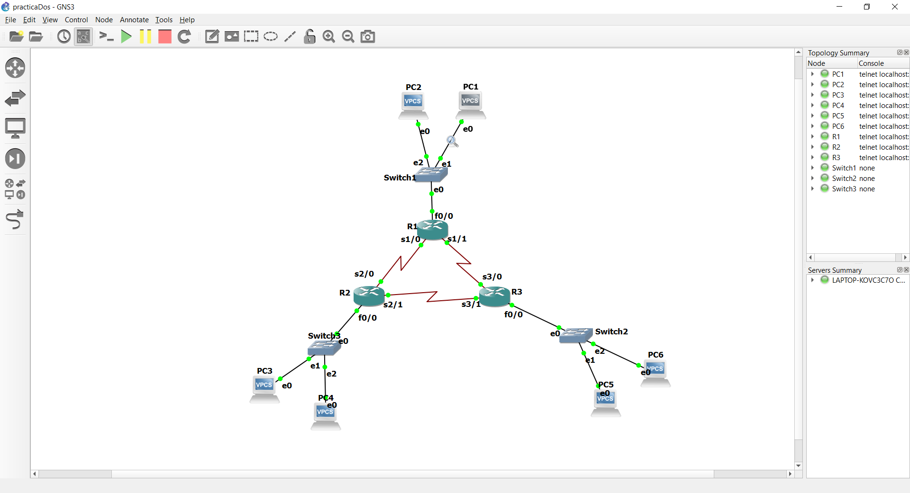
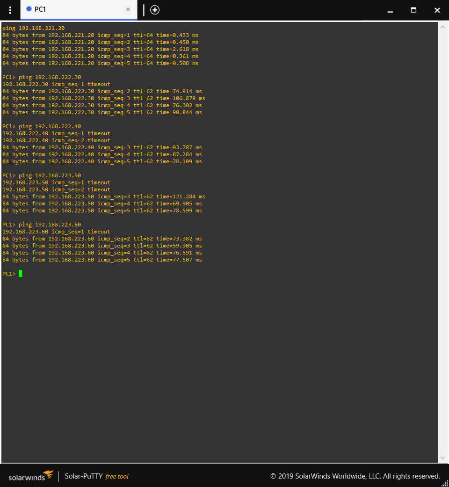

# MANUAL DE CONFIGURACION
## Universidad de San Carlos de Guatemala  
## Facultad de Ingenieria
## Escuela de Ciencias y Sistemas
## Redes de Computadoras 1
### Wilber Steven Zúñiga Ruano 202006629

# Configuracion
Carnet 202006629
Grupo 11
2+9+11 = 22


## Tablas de ips VPCS

|Maquina|IP| Gateway|
|---------|--------|----------|
|1 |192.168.221.10/24| 192.168.221.1|
|2 |192.168.221.20/24| 192.168.221.1|
|3 |192.168.222.30/24| 192.168.222.1|
|4 |192.168.222.40/24| 192.168.222.1|
|5 |192.168.223.50/24| 192.168.223.1|
|6 |192.168.223.60/24| 192.168.223.1|

 ## Tablas de ips ROUTERS 

|Conexion|Dirección de Red| Primera Direccion Asignable|
|---------|--------|----------|
|R1-R2 |172.221.0.0/16| 172.221.0.1 |
|R1-R3 |172.222.0.0/16| 172.222.0.1 |
|R2-R3 |172.223.0.0/16| 172.223.0.1 |




## COMANDOS:

R1-R2
```
conf t
int s1/0
ip address 172.221.0.1 255.255.0.0
no shutdown
exit
```

R1-R3
```
conf t
int s1/1
ip address 172.222.0.1 255.255.0.0
no shutdown
exit
```

R2-R1
```
conf t
int s2/0
ip address 172.221.0.2 255.255.0.0
no shutdown
exit
```

R2-R3
```
conf t
int s2/1
ip address 172.223.0.1 255.255.0.0
no shutdown
exit
```

R3-R1
```
conf t
int s3/0
ip address 172.222.0.2 255.255.0.0
no shutdown
exit
```

R3-R2
```
conf t
int s3/1
ip address 172.223.0.2 255.255.0.0
no shutdown
exit
```

R1-Switch
```
config t
int f0/0
ip address 192.168.221.1 255.255.255.0
no shutdown
exit
```

R2-Switch
```
config t
int f0/0
ip address 192.168.222.1 255.255.255.0
no shutdown
exit
```

R3-Switch
```
config t
int f0/0
ip address 192.168.223.1 255.255.255.0
no shutdown
exit
```

  

PC1
```
ip 192.168.221.10 255.255.255.0 192.168.221.1
save
```

PC2
```
ip 192.168.221.20 255.255.255.0 192.168.221.1
save
```

PC3
```
ip 192.168.222.30 255.255.255.0 192.168.222.1
save
```

PC4
```
ip 192.168.222.40 255.255.255.0 192.168.222.1
save
```

PC5
```
ip 192.168.223.50 255.255.255.0 192.168.223.1
save
```

PC6
```
ip 192.168.223.60 255.255.255.0 192.168.223.1
save
```

R1-R2
```
config t
ip route 192.168.222.0 255.255.255.0 172.221.0.2
exit
```

R2-R1
```
config t
ip route 192.168.221.0 255.255.255.0 172.221.0.1
exit
```

R1-R3
```
config t
ip route 192.168.223.0 255.255.255.0 172.222.0.2
exit
```

R3-R1
```
config t
ip route 192.168.221.0 255.255.255.0 172.222.0.1
exit
```

R2-R3
```
config t
ip route 192.168.223.0 255.255.255.0 172.223.0.2
exit
```

R3-R2
```
config t
ip route 192.168.222.0 255.255.255.0 172.223.0.1
exit
```

 Ver configuración de interfaces
```
sh ip int br
```
  
Ver tabla de ruteo
```
sh ip ro
```

